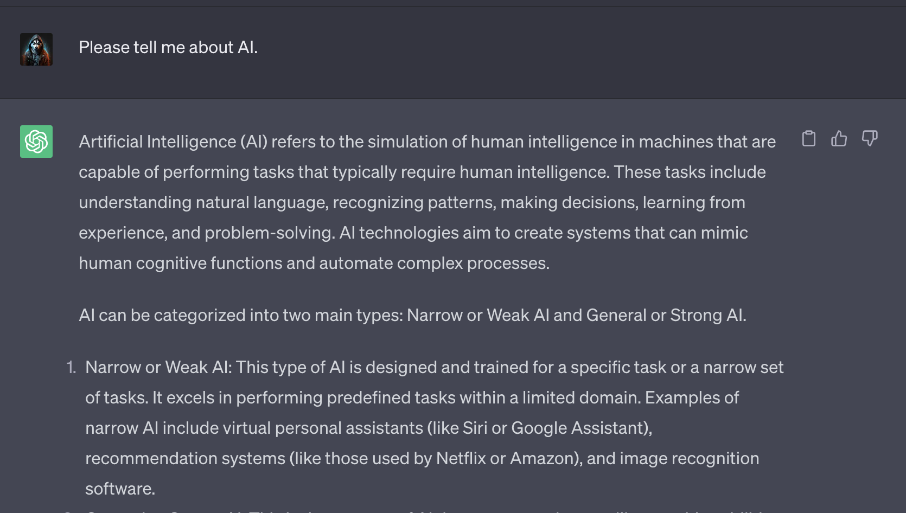
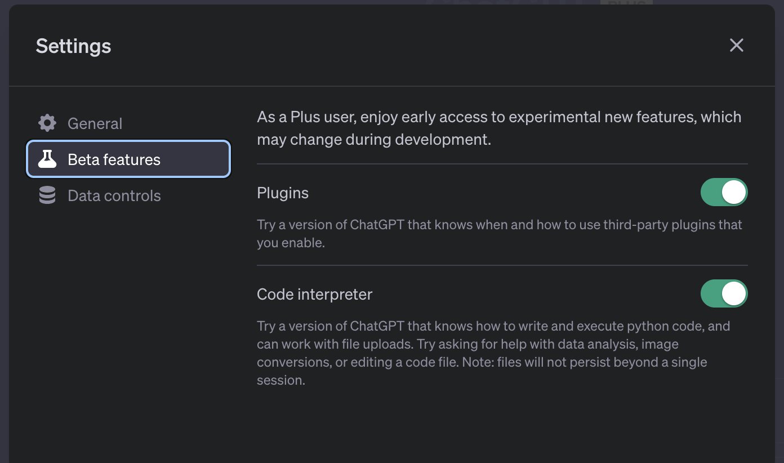
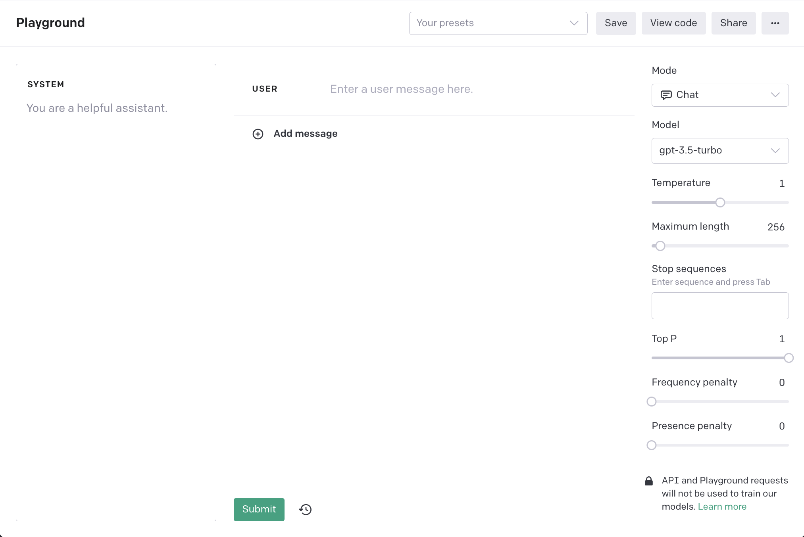
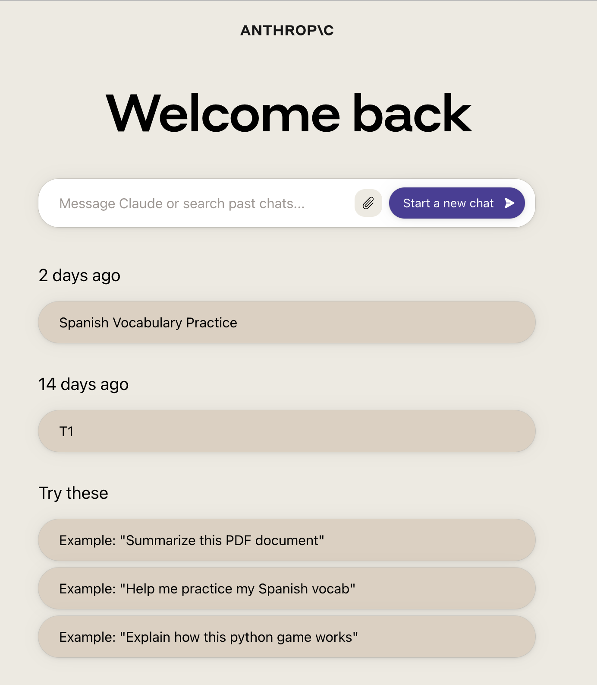

------

## [ChatGPT](https://chat.openai.com/)

ChatGPT is a chatbot based on the GPT-3 and GPT-4 architectures provided by the [OpenAI](https://openai.com/) lab. Since its establishment in 2015, OpenAI has been exploring language models, successively releasing GPT-2, GPT-3, and the widely used GPT-3.5 and GPT-4 LLM today. These models are trained with a vast amount of text data and can generate coherent and meaningful text. They are widely used in text generation, question and answer systems, text summarization, and other fields.

ChatGPT allows users to ask questions or give command tasks through chatting. ChatGPT provides a simpler way for human-computer interaction. Users don't need to learn machine language or advanced language in advance. By describing tasks or purposes in natural language, the AI model can "guess" your expected answer based on the content you provide. Whether it's students, tech developers, researchers, or text-related workers, when facing questions in life and work, they can think of using ChatGPT to get the desired answer. ChatGPT offers a simple, efficient, and mostly reliable way to save us time to do other interesting things.

Since the release of the ChatGPT product, its ecosystem has been slowly expanding, and many excellent official plugins have emerged. Users can install the required plugins from `Plugins`, and during the use of ChatGPT, AI will automatically determine whether to use the plugin function. For example, the `WebPilot` plugin can help users query real-time web page data, solving the problem that the LLM cannot obtain data after September 2021. Users who want to use the plugin function need to meet two conditions: first, become a paid user; second, turn on the plugin switch in `Settings`. The current plugin function is still in the Beta stage.

To facilitate engineering development, OpenAI also provides an [API](https://platform.openai.com/docs/api-reference) to call ChatGPT or interact directly with it in the OpenAI [Playground](https://platform.openai.com/playground). The Playground is generally used for debugging prompts. It provides parameters such as Mode, LLM, Temperature, and Maximum Length for debugging the final effect of the prompt. For what these parameters mean and how to set them, refer to the API documentation's [Create completion](https://platform.openai.com/docs/api-reference/completions/create) call parameter description.

It should be noted that ChatGPT itself is constantly improving. Whether it's upgrading from GPT-3.5 to GPT-4, the LLM itself is also constantly fine-tuning based on user feedback during actual use. The same prompt, even if the `Temperature` is set to 0, the result may still change. This change, in the long run, is definitely more beneficial than harmful. Whether it's model upgrades or fine-tuning, it will have varying degrees of impact on existing engineering projects based on ChatGPT technology. This impact in the short term is probably inevitable. The only thing that can be done is to keep up with the pace of AI technology development and be prepared for possible changes.

## [Claude.ai](https://claude.ai/chats)

Claude.ai is an AI assistant launched by [Anthropic](https://www.anthropic.com/). Anthropic focuses on the safety and reliability of AI and has released two LLMs, Claude and Claude Instant. The former is Anthropic's flagship model, good at generating everything from complex dialogues and creative content to detailed instructions. The latter is a faster, more economical model suitable for casual conversations, text analysis, summaries, and document understanding. Its core product, Claude.ai, is a chatbot created based on the Claude LLM.

Claude.ai features safety, intelligent processing, and personalized customization. According to the official introduction, Claude.ai uses constitutional AI to ensure data safety and reliability. The official webpage also emphasizes data security issues. Claude.ai can handle a large amount of text data and complex instructions (100K+ tokens) and can be customized according to user needs.

Claude.ai's actual use effect is roughly on par with GPT-3.5. However, thanks to the 100K+ context limit, it can handle more content and directly upload PDF files for processing. This has certain advantages over ChatGPT. It's worth mentioning that Claude.ai is still free to use. If there are data security requirements during use or file processing scenarios, Claude.ai is a good choice.

## [Midjourney](https://www.midjourney.com/home/)

Midjourney is a text-to-image service designed specifically for Discord users, allowing users to generate impressive images with simple text prompts. Users only need to access the Midjourney server on Discord and use the `/imagine` command to generate images based on the provided text prompts. Additionally, Midjourney offers a series of other commands, such as `/blend`, which allows users to upload and blend their images.

This tool has a wide range of use cases. Whether it's designers, artists, or ordinary users, they can use Midjourney to quickly turn their ideas into images. For example, designers can use it to create prototypes or concept maps for projects, while artists can use it to explore new artistic styles or ideas. Moreover, ordinary users can also use Midjourney to create custom backgrounds or avatars for their Discord servers.

The current version of Midjourney offers many new features, such as automatic image generation, image variants, and image enhancement. Users can use the `/imagine` command to generate four

 unique image options and then choose one for further editing or variation. Additionally, Midjourney provides a series of tools, such as zooming in, zooming out, and panning, to help users perfect their images. Overall, Midjourney is a powerful and easy-to-use tool that offers Discord users a new way to express their creativity.

The latest Midjourney V5.2 model was released in June 2023. It has been optimized in terms of color, contrast, and composition, making the generated images more detailed and sharp. Additionally, the V5.2 model has a deeper understanding of text prompts and responds better to the full range of the `--stylize` parameter. At the same time, Midjourney also released the V5.1 model, which has a stronger default aesthetic effect under simple text prompts and supports advanced features like `--tile`, making repetitive patterns simpler. Additionally, Midjourney collaborated with Spellbrush to launch the Niji model, designed specifically for generating anime and illustration-style images.

## [Stable Diffusion](https://stablediffusionweb.com/)

Stable Diffusion is an advanced text-to-image diffusion model that can generate realistic images based on any text input. This tool gives users a free creative space, enabling billions of people to create stunning artworks in seconds. Users can create images using the latest released Stable Diffusion image generation model on the official page. Just enter a text prompt and click generate to get a high-quality image. Additionally, the tool emphasizes user privacy, not collecting, using, or storing any personal information, text, or images.

The dataset behind Stable Diffusion is the 2b English label subset of LAION 5b, a general crawl of the internet created by the German charity LAION. Additionally, images created through Stable Diffusion Online are entirely open-source, explicitly belonging to the CC0 1.0 Universal Public Domain Dedication. For those who want to quickly transform text ideas into images, Stable Diffusion offers a simple, efficient, and intuitive solution.

For those who want to use Stable Diffusion in a local environment, the tool offers an option for personal private deployment. This means users can run Stable Diffusion on their servers or computers, ensuring data privacy and security. Additionally, the tool emphasizes user privacy, not collecting, using, or storing any personal information, text, or images. Moreover, Stable Diffusion is compatible with various GPUs. As long as they have 6GB or more of VRAM, most NVidia and AMD GPUs can run Stable Diffusion.