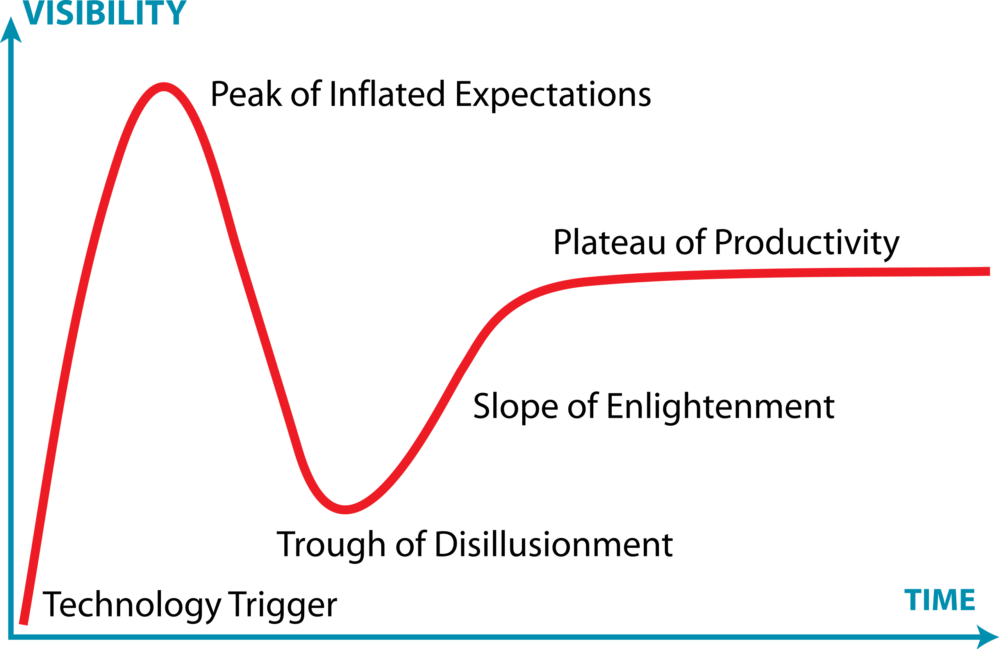

------

## Prompting

### From Simple to Structured

The emergence of GPT-3.5 has made people truly recognize the potential of LLMs (LLMs) and begin to interact with them using directive prompts. We are still in the early stages of LLMs, where prompts are often simple and direct, such as "Please translate the following content into a specific language" or "Explain the basic principles of economics." However, as the processing capabilities of the models increase, we begin to explore the possibilities of LLMs and try to use them to address more complex yet valuable problems. We realize that simple prompts can no longer meet the demands of intricate tasks. Hence, structured prompts have emerged.

Structured prompts not only contain basic task information but also provide more context for the model, allowing it to better understand the essence of the task. For instance, when we want to provide more complex processing content, we should use a specific format to delineate content areas. This allows the large model to distinguish between the description of the task content itself and the target content of the task. For intricate tasks, to enhance result consistency, we break down the task into sub-tasks, allowing the LLM to process them sequentially to achieve a `COT` effect. These are the current heights that prompts have reached. It's foreseeable that future scenarios will be even more complex, possibly requiring users to convey their needs to LLMs in more efficient ways. This efficiency won't be about piling up context but will be a practical result after understanding the design pattern of LLMs.

### From Singular to Composite

No matter how optimized a single prompt is, its task complexity and scope are limited. Often, we only have intentions and expected results and cannot convert these thoughts into comprehensive prompts. In some cases, the intermediate process of LLMs handling tasks depends on external information. These practical needs have driven us to consider whether the output of one prompt can be used as the input for another. If so, the intermediate state between prompts and prompts possesses numerous possibilities.

Composite prompts can be chain-like, enumerative, or tree-structured, transforming a complex task into a complete process. The result produced by one prompt can directly enter the next, or it can interact with the user, offering choices and determining the direction of the result. For instance, when we feel hungry but have no clear idea to address it, the first prompt can analyze the user's state and provide choices, such as cooking at home or dining out. Here, the LLM can analyze the user's expression and tone to determine the level of hunger and then recommend a method. If the user's choice is to dine out, the core task of the next prompt should be to obtain necessary information for dining out, such as querying available restaurants or dishes, and then generating choices or results, depending on whether this composite task ends here.

### Changes in Application Scenarios

As we gain a deeper understanding of LLMs and prompts, the application scenarios of prompts are changing, moving towards specialization and depth. Initially, most users recognized and used LLMs from the breadth of LLMs, hoping they could help solve problems in various aspects of life and work, such as how to make a dish, explain the difference between shortage and scarcity in economics, or plan a trip. Using LLMs and prompts to help us solve these problems can save us a lot of time. However, it also raises a question: If I am a dentist or a lawyer, what can I do with LLMs and prompts? This is a professional perspective on LLMs. There isn't a definitive answer to this question now, but one can refer to Bloomberg's construction of an LLM for professional users using its financial data, specifically designed to address market and investment-related questions. In the near future, more individuals or institutions will apply LLMs and prompts to more specialized niches. Facing increasingly professional problems requires the design of prompts to shift from generality to specialization.

### Commercial Value and Ecosystem

When people realize that prompts can indeed help improve production efficiency, they are naturally willing to pay for it. Currently, there are prompt trading markets and prompt communities on the market where users can create and debug prompts and then sell them. These prompts, whether in terms of professionalism or practical application, are of very high quality.

There are also some opposing voices, believing that prompts should be shared as a public resource rather than sold as a commodity. From the perspective of technological development, this viewpoint is very reasonable in the early stages of development. The goal at this time is to let people understand this technology rather than use the new technology as a gimmick for monetization. However, in the long run, as the technology matures, the commercial value of prompts will be reflected. It can not only promote prompt innovation and sharing but also bring tremendous value to the entire LLM ecosystem. It's essential to understand that any technological innovation and development need market support. If no one is willing to pay, who would spend time and energy designing a higher-quality prompt? Or why should you get this high-quality prompt from someone else? It's foreseeable that the future prompt trading system will definitely become more mature, and there won't be any blind box-style trading methods like now.

## Large Language Models

The development of prompts is inseparable from LLMs. Essentially, prompts are a means for humans to interact with LLMs. The changes in LLMs are constantly affecting prompt technology, and I believe they will influence each other.

### Text to Image

OpenAI's Chief Scientist, Ilya Sutskever, mentioned in an interview with Nvidia's Jensen Huang that LLMs are moving towards multimodality. The capabilities of LLMs are no longer limited to text. Image processing capabilities allow the model to extract information from images, understand the story or context behind the image, and generate related text descriptions. For example, the model can generate art reviews or historical backgrounds related to a painting. The combination of voice recognition and generation technologies allows the model to interact with users more naturally, encompassing not only textual communication but also understanding of tone, emotion, and context. Processing video content is even more complex because it involves a comprehensive understanding of images, sound, and time sequences. The model needs to understand the actions, contexts, and storylines in the video and generate related descriptions, reviews, or summaries.

### Private Models

In the wave of technology, every company is thinking about how to combine their existing business and data with LLMs. However, they also face a tough issue: internal data cannot be transferred externally. Private models have effectively addressed this problem. Many LLMs have now open-sourced their code. Every day, new content appears on [HuggingFace](https://huggingface.co/). Both individual developers and companies can create their own LLMs by combining open-source models with their data. This approach offers higher data security and privacy protection. Companies can train and fine-tune models on their private data, ensuring that the data is not accessed externally. This is especially important for industries involving sensitive information, such as finance, medicine, and law. Advances in fine-tuning technology allow models to adapt better to specific tasks or fields, providing more precise and professional outputs. Research on synthetic training data offers more possibilities for model training. Models can be pre-trained on synthetic data and then fine-tuned on real data, which can not only improve model performance but also reduce dependence on real data.

### Data Security

The development of LLMs involves not only updates to algorithms and upgrades to hardware devices but also training datasets. Regarding training datasets, we can pose a question:

When users use LLMs, are they also providing training data?

There is no clear answer to this question now, and there may not be one in the future. If someone tells you there's a definitive answer now, there are only two possibilities: first, they're deceiving you; second, they don't understand either. The official homepages of existing LLMs emphasize a crucial feature, `Safety`, whether it's user data safety or fine-tuning model training data safety. However, the development of LLMs is inseparable from training data. I believe that as technology advances and the market matures, there will be a reasonable solution to data security issues (the current solution of having AI generate training data is a good approach). It may not be perfect, but it should be acceptable to most people.

## Summary

Here is the Technology Maturity Curve

For LLMs, such as OpenAI's GPT series, looking at their development trajectory, they have already experienced the "technology trigger" phase because the initial small language models attracted widespread attention from academia and industry. With the increase in model size and the widespread promotion of applications, it may have entered or is approaching the "peak of inflated expectations" phase. In this phase, people have high expectations for LLMs, believing they can solve many NLP problems, but there's also a risk of over-hype.

Over time, people may find that LLMs are not omnipotent. They may not perform as well as specially designed models in some specific tasks. This might lead the technology into the "trough of disillusionment" phase.

However, when facing a new technology, we should view it positively rather than pessimistically. In the future, AI technology will undoubtedly be one of the most crucial technologies. Keeping up with technological developments and using new technologies to create value is one of the essential skills. This skill can help you find a comfortable foothold in the wave of AI.