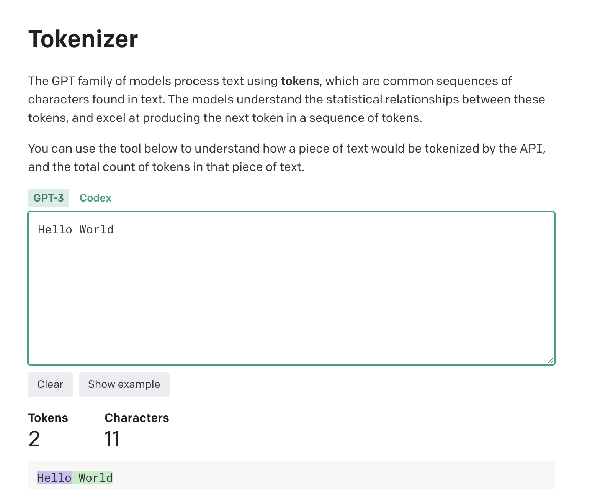

------

1. Before submitting prompts to the LLM like GPT, you can calculate the number of prompt tokens using the [tokenizer](https://platform.openai.com/tokenizer) tool. Taking GPT-3.5 input as an example, it costs $0.0015 per 1000 tokens.

2. Try to ask questions in English. Most of the training data for the current large language models is in English, so asking in English might yield better results.

3. TODO.

