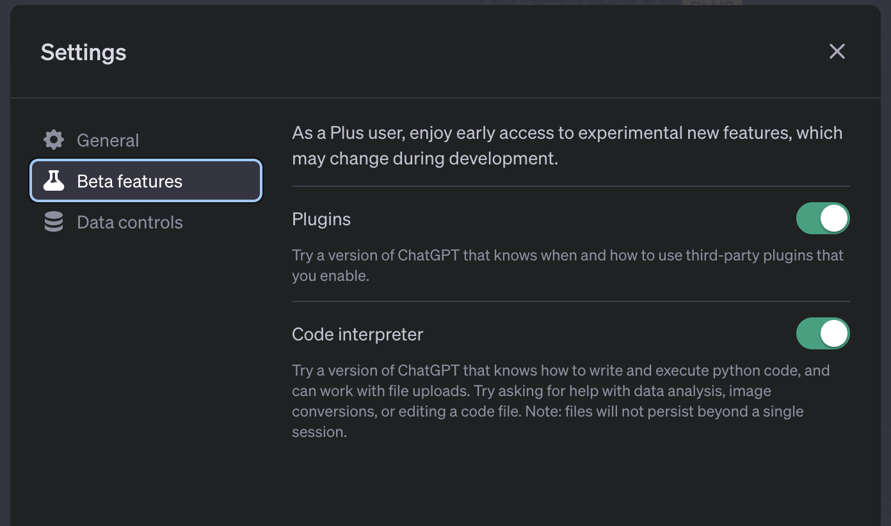

------

## [ChatGPT](https://chat.openai.com/)

ChatGPT 是 [OpenAI](https://openai.com/) 实验室提供的一个基于 GPT-3 和 GPT-4 架构的聊天机器人。自 2015年成立，OpenAI 一直在语言模型上进行探索，先后发布了 GPT-2，GPT-3，到今天被广泛使用的 GPT-3.5 和 GPT-4 这几个大语言模型。这些模型通过大量的文本数据进行训练，能够生成连贯、有意义的文本，广泛应用于文本生成、问答系统、文本摘要等多个领域。

ChatGPT 允许用户通过聊天的方式进行提问或者下达指令任务。ChatGPT 给人机交互提供了一种更为简单的方式，用户不需要提前学习机器语言或者高级语言，通过自然语言去描述任务或者目的，AI 模型就能根据你提供的内容“猜”出你预期的答案。无论是学生，技术开发，研究人员或者文字类相关的工作人员，在面对生活和工作过程中的问题，都可以想到使用 ChatGPT 来获取想要的答案。ChatGPT 提供了一种简单，高效、大多数情况下还算可靠的方式，帮助我们节省了时间去做一些其他有趣的事。

ChatGPT 产品发布至今，其生态也在慢慢扩大，涌现出了非常多优秀的官方插件。用户可从 `Plugins` 安装需要的插件，然后在使用 ChatGPT 的过程中，AI 会自动判断是否使用插件功能。例如，`WebPilot` 插件可以帮助用户查询实时的网页数据，解决了大语言模型无法获取2021年9月之后的数据的问题。用户想使用插件功能需要满足两个条件，第一：成为付费用户；第二：在 `Settings` 打开插件开关，当前插件功能仍处于 Beta 阶段。

为了方便工程开发，OpenAI 还提供了 [API](https://platform.openai.com/docs/api-reference) 接口调用 ChatGPT，或者在 OpenAI [Playground](https://platform.openai.com/playground) 中直接与其交互。Playground 一般用于调试 prompt，Playground 提供了模式（Mode），大语言模型（Model），温度（Temperature）以及最大输出长度（Maxium Length）等参数配置用于调试 prompt 的最终效果。关于这些参数代表什么意思，如何设置这些参数，可参考 API 文档中 [Create completion](https://platform.openai.com/docs/api-reference/completions/create) 调用参数说明。

需要额外说明的是，ChatGPT 自身的在不断提升，无论是从 GPT-3.5 升级到 GPT-4，大语言模型本身也在不断根据用户在实际使用过程中的反馈在进行微调，同样的 prompt 虽然 `Temperature` 设置为 0，但结果还是可能会发生改变，这种改变长远看肯定是利大于弊。无论是模型的升级或者微调，都会对已有基于 ChatGPT 技术开发的工程项目产生不同程度的影响，这个影响短期应该是不可避免的，唯一能做的就是紧跟 AI 的技术发展步伐，对可能即将到来的改变做好准备。

## [Claude.ai](https://claude.ai/chats)

Claude.ai 是 [Anthropic](https://www.anthropic.com/) 推出的一款 AI 助手。Anthropic 公司重点研究 AI 的安全性和可靠性，发布了两个大语言模型 Claude 和 Claude Instant。前者是 Anthropic 的旗舰模型，擅长从复杂的对话和创意内容生成到详细的指令，后者属于更快、更经济的模型，适合随意对话、文本分析、摘要和文档理解。其核心产品 Claude.ai 则是基于 Claude 大语言模型创建的聊天机器人。

Claude.ai 具有安全性、智能处理和个性化定制等特点。根据官方介绍 Claude.ai 采用宪法式 AI，确保数据安全性和可靠性，在其官方网页中也在一直强调数据安全的问题。Claude.ai 能够处理大量文本数据和复杂的指令（100K+ token），并且可以根据用户需求进行个性化定制。

Cluade.ai 实际使用效果和 GPT-3.5 的水平差不多，不过得益于100K+ 上下文限制，能够处理更多的内容并且可直接上传 PDF 文件进行处理，这点相较于 ChatGPT 有一定的优势。值得一提的是，当前 Claude.ai 仍是免费使用，如果对于使用过程中数据安全有要求或者有文件处理的场景，Claude.ai 是个不错的选择。

## [Midjourney](https://www.midjourney.com/home/)

Midjourney 是一个专为 Discord 用户设计的文本到图像服务，允许用户通过简单的文本提示生成令人印象深刻的图片。用户只需在 Discord 上访问 Midjourney 服务器，使用 `/imagine` 命令，即可根据所提供的文本提示生成图片。此外，Midjourney 还提供了一系列其他命令，如 `/blend`，允许用户上传并混合自己的图片。

该工具的使用场景非常广泛。无论是设计师、艺术家还是普通用户，都可以利用 Midjourney 快速将创意转化为图像。例如，设计师可以使用它来为项目创建原型或概念图，而艺术家则可以使用它来探索新的艺术风格或创意。此外，普通用户也可以使用 Midjourney 来为他们的 Discord 服务器创建自定义的背景或头像。

当前版本的 Midjourney 提供了许多新功能，如自动图像生成、图像变体和图像增强。用户可以使用 `/imagine` 命令生成四个独特的图像选项，然后选择其中一个进行进一步的编辑或变体。此外，Midjourney 还提供了一系列工具，如放大、缩小和平移，以帮助用户完善他们的图像。总的来说，Midjourney 是一个强大、易用的工具，为 Discord 用户提供了一种全新的创意表达方式。

最新的 Midjourney V5.2 模型于 2023 年 6 月发布，它在颜色、对比度和构图方面都有所优化，使生成的图像更为细致和锐利。此外，V5.2 模型对文本提示的理解也更为深入，能够更好地响应 `--stylize` 参数的全范围。与此同时，Midjourney 还发布了 V5.1 模型，该模型在简单的文本提示下具有更强的默认美学效果，支持如 `--tile` 的高级功能，使重复模式更为简单。此外，Midjourney 还与 Spellbrush 合作推出了 Niji 模型，专为生成动漫和插图风格的图像而设计

## [Stable Diffusion](https://stablediffusionweb.com/)

Stable Diffusion 是一个先进的文本到图像扩散模型，能够根据任何文本输入生成逼真的图片。这款工具赋予用户自由的创意空间，使数十亿人能够在几秒钟内创作出令人惊叹的艺术作品。用户可在官方页面，使用最新发布的 Stable Diffusion 图像生成模型创建图像。只需输入文本提示并点击生成，即可得到高质量的图像。此外，该工具还特别强调用户的隐私，不收集、使用或存储任何个人信息、文本或图像。

Stable Diffusion 的背后数据集是 LAION 5b 的 2b 英语标签子集，这是由德国慈善机构 LAION 创建的互联网的一般爬取。此外，通过 Stable Diffusion Online 创建的图像完全是开源的，明确属于 CC0 1.0 通用公共领域贡献。对于那些希望将文本创意快速转化为图像的用户，Stable Diffusion 提供了一个简单、高效且直观的解决方案。

对于那些希望在本地环境中使用 Stable Diffusion 的用户，该工具提供了个人私有化部署的选项。这意味着用户可以在自己的服务器或计算机上运行 Stable Diffusion，确保数据的隐私和安全。此外，该工具特别强调用户的隐私，不收集、使用或存储任何个人信息、文本或图像。此外，Stable Diffusion 还与多种 GPU 兼容，只要具有 6GB 或更多的显存，大多数 NVidia 和 AMD GPU 都可以运行 Stable Diffusion。
