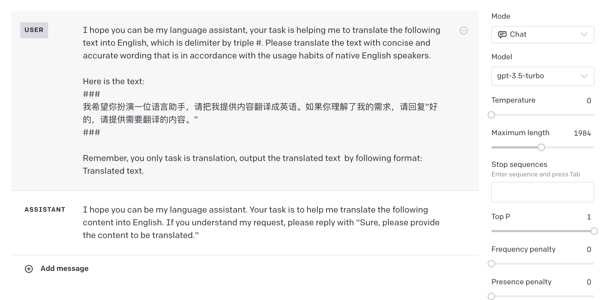
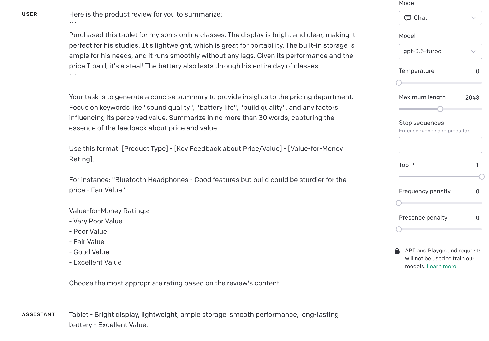

------

## 翻译


### 日常翻译

```
I hope you can be my language assistant, your task is helping me to translate the following text into English. Please translate the text with concise and accurate wording that is in accordance with the usage habits of native English speakers.

Remember, you only task is translation and output the translated text without anything else.  Here is my first text: "你好"
```


提示词分析：

1. 给 AI 设置语言助手的角色，明确告知 AI 任务内容为翻译。
2. 对翻译风格和翻译后的内容提出具体需求，这部分可根据实际使用场景进行更改，例如增加用词专业性，不同场景用语等。
3. 强调只有翻译任务，规范输出内容，避免 AI 对翻译内容进行额外的操作，例如内容解释或者当作 prompt 进行回应。
4. 给出翻译内容格式，后续提供相同形式的内容，AI 会根据上下文将内容识别为待翻译内容进行处理。


GPT-3.5 测试效果：


### 翻译开发

```
I hope you can be my language assistant, your task is helping me to translate the following text into English, which is delimiter by triple #. Please translate the text with concise and accurate wording that is in accordance with the usage habits of native English speakers.

Here is the text: 
###
{text}
###

Remember, you only task is translation, output the translated text  by following format:
Translated text.
```


提示词分析：

1. 给 AI 设置语言助手的角色，明确告知 AI 任务内容为翻译，并规范翻译内容区间，通过3个#进行划分。
2. 对翻译风格和翻译后的内容提出具体需求，这部分可根据实际使用场景进行更改，例如增加用词专业性，不同场景用语等。
3. 中间插入待翻译内容，翻译内容以变量的形式存在，具体在开发过程中需要替换为实际待翻译内容。
4. 补充说明 AI 任务为翻译，同时规定输出内容格式，目的是为了保证在实际开发场景中结果的稳定性。


GPT-3.5 测试结果：




## 总结


### 商品评价总结

````
Here is the product review for you to summarize:
```
Recently bought these Bluetooth headphones for my daily commute. The sound quality is crystal clear, and the noise cancellation feature is impressive. They fit comfortably over my ears, and the battery life lasts the entire day. However, considering the price, I expected a more durable build. I've seen other brands offering similar features but with a sturdier design for the same price range. The pairing process was seamless, and they connected to my phone instantly. Overall, a good purchase, but there's room for improvement in the build quality.
```

Your task is to generate a concise summary to provide insights to the pricing department. Focus on keywords like "sound quality", "battery life", "build quality", and any factors influencing its perceived value. Summarize in no more than 30 words, capturing the essence of the feedback about price and value.

Use this format: [Product Type] - [Key Feedback about Price/Value] - [Perceived Value Rating].

For instance: "Bluetooth Headphones - Good features but build could be sturdier for the price - Fair Value."

Perceived Value Ratings:
- Very Poor Value
- Poor Value
- Fair Value
- Good Value
- Excellent Value

Choose the most appropriate rating based on the review's content.
````


提示词分析：

1. 目标商品评价内容前置，通过特殊符号区分内容区域，可避免目标内容于任务描述内容混淆。

2. 明确说明任务目的，同时对任务背景进行说明。

3. 明确说明总结的目标范围是和产品的感知价值相关的内容。

4. 规定输出内容不能超过30个单词，同时按照给定的格式进行输出，结果更加直观，方便快速获取有用的信息。

5. `One-shot` 给出输出示例，提高输出稳定性。

   

GPT-3.5 测试结果：




### 研究报告总结

```
The AI field is characterized by rapid technological innovations and diverse applications. Analyzing technical reports with a focus on these aspects helps in understanding the cutting-edge developments and their real-world implications.

Analysis Requirements:
1. Provide a brief summary of the report's main objectives and findings.
2. Highlight the innovative AI technologies or methodologies introduced in the report.
3. Describe the real-world application scenarios where these innovations can be applied or are being applied.
4. Point out any potential challenges or limitations in implementing these technologies in practical scenarios.
5. Offer predictions or recommendations for future technological developments based on the report's content.
6. Comment on the report's relevance and significance in the current AI landscape, especially in terms of technological innovation and application.

Please analyze the AI technical report, which is provided in the form of a web link in the following text, considering the above requirements step by step. 

Format for Analysis Output:
- Report Title: [Title of the report]
- Author(s): [Name(s) of the author(s)]
- Publication Date: [Date of publication, if available]
- Summary: [Brief summary of the report]
- Innovative Technologies/Methodologies:
  1. [First innovative technology/methodology]
  2. [Second innovative technology/methodology]
  3. [And so on...]
- Application Scenarios:
  1. [First application scenario]
  2. [Second application scenario]
  3. [And so on...]
- Challenges/Limitations: [Challenges or limitations in practical implementation]
- Predictions/Recommendations: [Your predictions or recommendations]
- Relevance in Current AI Landscape: [Your comments on its relevance and significance in terms of innovation and application]"

Report web link: {web_link}
```


提示词分析：

1. 提示词明确指出了分析的重点和目标，如技术创新和实际应用场景。通过列出具体的分析要求，它确保了GPT能够全面地进行分析，从而满足用户的具体需求和期望。
2. 提示词为GPT提供了清晰的分析框架，包括AI领域的背景信息和指定的输出格式。这种结构化的方法确保了GPT生成的内容既结构清晰又易于理解，从而提高了分析的质量和可读性。
3. 提示词涵盖了从技术到应用，再到挑战和未来预测的多个方面。此外，它还包含了报告的基本信息，如标题、作者和发布日期，确保了分析的全面性和完整性。
4. 通过使用占位符和模块化的结构，提示词模板可以轻松地应用于多种AI技术报告的分析。其灵活的结构允许用户根据需要进行微调，以满足特定的分析需求，从而提供了高度的适应性。


## 推断


产品评价推断

```
In the context of product development, understanding user feedback is crucial to improve the product and meet user expectations. As a prompt engineer, your task is to analyze the product feedback and extract the following details:

- Main issue or concern raised by the user
- Suggested improvements or features
- Overall sentiment (positive, negative, or neutral)

The feedback is delimited with triple backticks. Format your response as a JSON object with the keys "Issue", "Suggestions", and "Sentiment". If the information isn't present, use "unknown" as the value.

Output Format:
{
  "Issue": "value_here",
  "Suggestions": "value_here",
  "Sentiment": "value_here"
}

Keep your response concise and accurate.

Product Feedback:  ```{feedback_text}```
```


提示词分析：

1. 提供了产品开发背景，为模型建立了理解用户反馈的上下文和重要性。
2. 清晰定义了任务，要求模型从反馈中提取关键信息：问题、建议和情感。
3. 通过三个反引号界定反馈内容，确保模型准确处理输入数据，并规定了具体的 JSON 输出格式。
4. 对于不确定或缺失的数据，提供了"unknown"作为标准响应，确保输出的一致性。
5. 使用 `{feedback_text}` 作为占位符，增强了提示词的通用性和模型的输入准确性。


GPT-3.5 测试结果：


