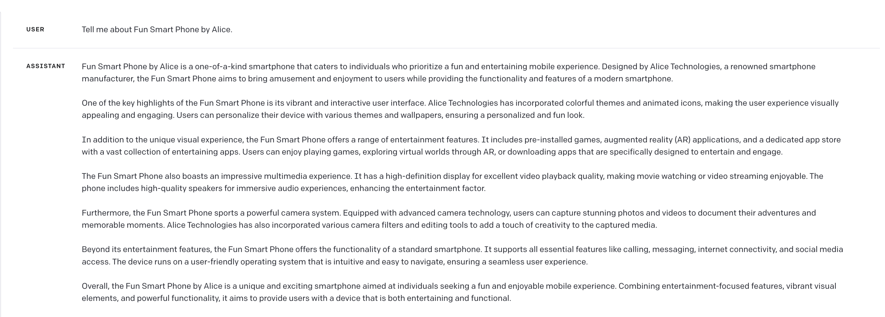

----

### 什么是幻觉 （Hallucination）？

LLM 会对你的提问或者是任务进行回复，这种回复本质是基于训练数据一个字一个字地去“猜”你想要的答案。但这个答案并不能保证是真实的，也不能保证答案一定正确，LLM 有可能在一本正经地胡说八道，这也是为什么现在有些企业仍然没有大规模将 LLM 投入到实际的生产中。

Alice 公司生产的开心牌智能手机（并不存在）

### 为什么会产生幻觉？

我们现在所使用的 LLM 都是基于历史数据训练后的产品，类似于 GPT 这样模型，其训练数据量非常庞大并且涵盖范围广泛，包括文字，代码，甚至是图片信息。这种模式存在一个问题，用于训练的数据本身就是不真实的、不完整的或是人为创建的虚假信息，这些信息并不符合客观事实但也会被用于模型训练。基于这种模式的 LLM 在执行过程中，是在创建与预期答案相关性最高的答案，就容易产生 Hallucination 问题。

### 如何减少幻觉？

1. 无论是普通用户还是专业用户，最优先考虑找一个尽可能 “真实”的 LLM 产品。至于如何判断是否足够真实，实践才能出结果。
2. 首先找到相关信息，根据相关信息回答问题。
3. 检查结果是否基于提供的信息。

 
