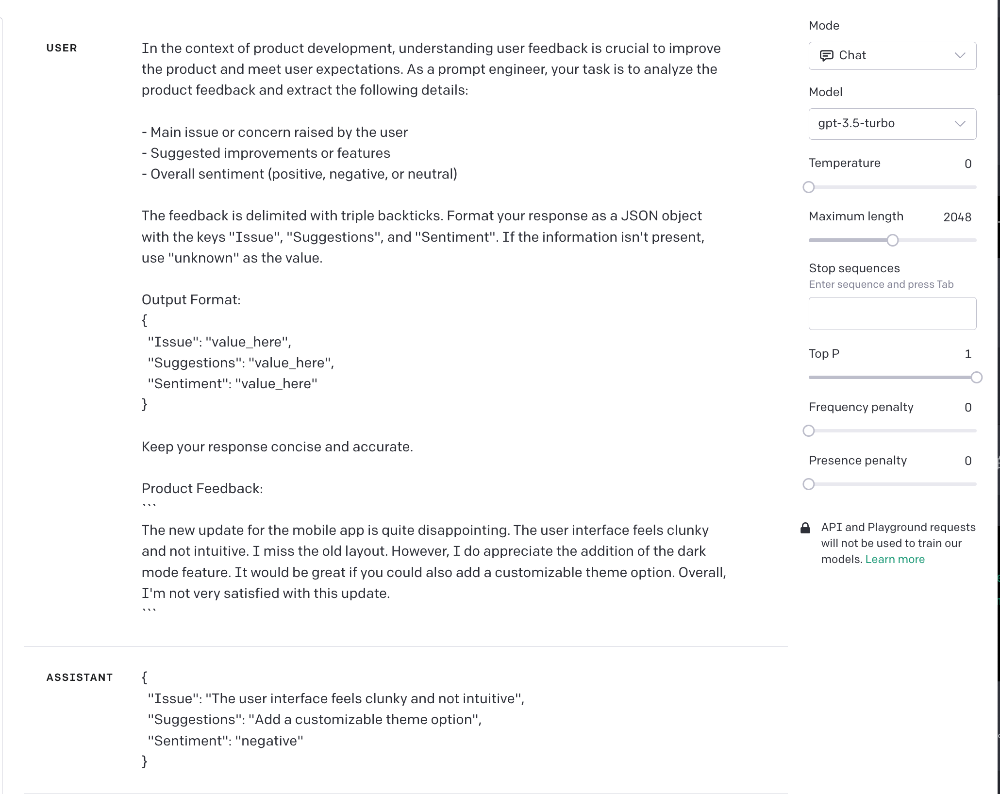

----

产品评价推断

```
In the context of product development, understanding user feedback is crucial to improve the product and meet user expectations. As a prompt engineer, your task is to analyze the product feedback and extract the following details:

- Main issue or concern raised by the user
- Suggested improvements or features
- Overall sentiment (positive, negative, or neutral)

The feedback is delimited with triple backticks. Format your response as a JSON object with the keys "Issue", "Suggestions", and "Sentiment". If the information isn't present, use "unknown" as the value.

Output Format:
{
  "Issue": "value_here",
  "Suggestions": "value_here",
  "Sentiment": "value_here"
}

Keep your response concise and accurate.

Product Feedback:  ```{feedback_text}```
```


提示词分析：

1. 提供了产品开发背景，为模型建立了理解用户反馈的上下文和重要性。
2. 清晰定义了任务，要求模型从反馈中提取关键信息：问题、建议和情感。
3. 通过三个反引号界定反馈内容，确保模型准确处理输入数据，并规定了具体的 JSON 输出格式。
4. 对于不确定或缺失的数据，提供了"unknown"作为标准响应，确保输出的一致性。
5. 使用 `{feedback_text}` 作为占位符，增强了提示词的通用性和模型的输入准确性。


GPT-3.5 测试结果：

