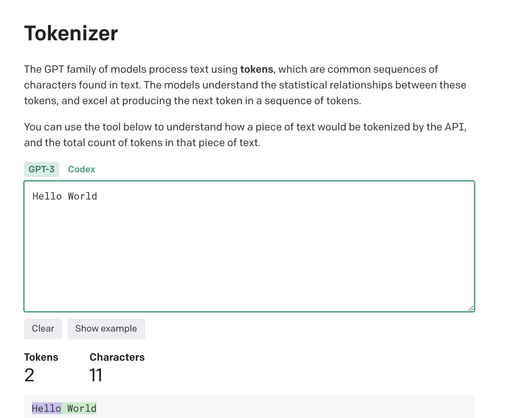

------

## Token 计数器
提示词提交给大语言模型之前，可以通过 [tokenizer](https://platform.openai.com/tokenizer) 工具计算提示词 token 数量，以 GPT-3.5 input 举例 $0.0015/1000 tokens。

## 翻译成英文
尽量使用英文提问，现有大语言模型的训练数据大多数都是英文数据，用英文提问效果可能会更好。

