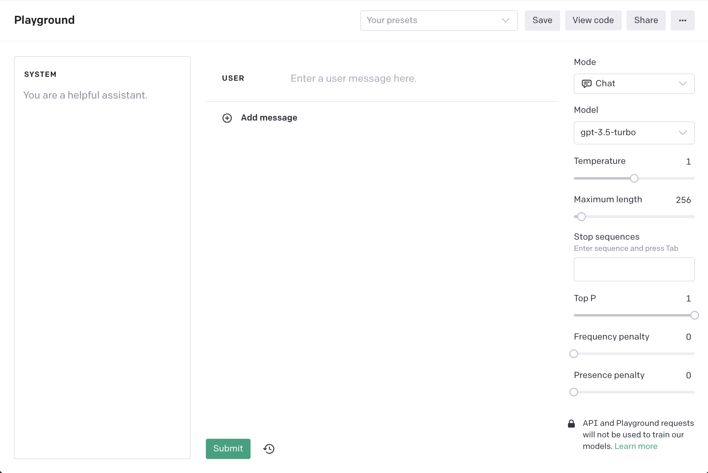

----

ChatGPT 是 [OpenAI](https://openai.com/) 实验室提供的一个基于 GPT-3 和 GPT-4 架构的聊天机器人。自 2015年成立，OpenAI 一直在语言模型上进行探索，先后发布了 GPT-2，GPT-3，到今天被广泛使用的 GPT-3.5 和 GPT-4 这几个大语言模型。这些模型通过大量的文本数据进行训练，能够生成连贯、有意义的文本，广泛应用于文本生成、问答系统、文本摘要等多个领域。

ChatGPT 允许用户通过聊天的方式进行提问或者下达指令任务。ChatGPT 给人机交互提供了一种更为简单的方式，用户不需要提前学习机器语言或者高级语言，通过自然语言去描述任务或者目的，AI 模型就能根据你提供的内容“猜”出你预期的答案。无论是学生，技术开发，研究人员或者文字类相关的工作人员，在面对生活和工作过程中的问题，都可以想到使用 ChatGPT 来获取想要的答案。ChatGPT 提供了一种简单，高效、大多数情况下还算可靠的方式，帮助我们节省了时间去做一些其他有趣的事。

ChatGPT 产品发布至今，其生态也在慢慢扩大，涌现出了非常多优秀的官方插件。用户可从 `Plugins` 安装需要的插件，然后在使用 ChatGPT 的过程中，AI 会自动判断是否使用插件功能。例如，`WebPilot` 插件可以帮助用户查询实时的网页数据，解决了大语言模型无法获取2021年9月之后的数据的问题。用户想使用插件功能需要满足两个条件，第一：成为付费用户；第二：在 `Settings` 打开插件开关，当前插件功能仍处于 Beta 阶段。

为了方便工程开发，OpenAI 还提供了 [API](https://platform.openai.com/docs/api-reference) 接口调用 ChatGPT，或者在 OpenAI [Playground](https://platform.openai.com/playground) 中直接与其交互。Playground 一般用于调试 prompt，Playground 提供了模式（Mode），大语言模型（Model），温度（Temperature）以及最大输出长度（Maxium Length）等参数配置用于调试 prompt 的最终效果。关于这些参数代表什么意思，如何设置这些参数，可参考 API 文档中 [Create completion](https://platform.openai.com/docs/api-reference/completions/create) 调用参数说明。

需要额外说明的是，ChatGPT 自身的在不断提升，无论是从 GPT-3.5 升级到 GPT-4，大语言模型本身也在不断根据用户在实际使用过程中的反馈在进行微调，同样的 prompt 虽然 `Temperature` 设置为 0，但结果还是可能会发生改变，这种改变长远看肯定是利大于弊。无论是模型的升级或者微调，都会对已有基于 ChatGPT 技术开发的工程项目产生不同程度的影响，这个影响短期应该是不可避免的，唯一能做的就是紧跟 AI 的技术发展步伐，对可能即将到来的改变做好准备。

[Official Link](https://chat.openai.com/)